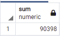

# Pewlett-Hackard-Analysis

## Overview of the analysis

The analysis aims to show the manager number of retiring employees with their titles. Based on this report, he will know who is eligible to take part in a mentorship program. Then, the analysis will suggest the manager some advices to handle “silver tsunami”.

## Results 

-	There are high numbers of employees (29414) whose title is Senior Engineer will retire soon along with Senior Staff (28254). So, Senior positions are about to retire compared to other titles. 

-	There are many people are eligible for mentorship (about 1550) shown in the csv file.

 

-	DISTINCT () function is necessary as there will be duplication in many data set due to changing roles, departments, etc 

 

-	The unique titles table shows no duplication in the titles of employees.

 

## Summary

-	How many roles will need to be filled as the "silver tsunami" begins to make an impact?

I add a query to know number of each criteria. 

select sum(count)
from retiring_titles;
select count(title)
from retiring_titles

So, there are 7 roles that will be filled and 90398 employees in these roles will retire soon.

 
 

-	Are there enough qualified, retirement-ready employees in the departments to mentor the next generation of Pewlett Hackard employees?

I use this query to retrieve the number of eligible mentors: 

select count(emp_no)
from mentorship_eligibility;

So, the result is that there are 1549 eligible mentors available, but 90398 employees will be aging and retire. Then, we need to train more people to become eligible mentors for the next generation. 

 
